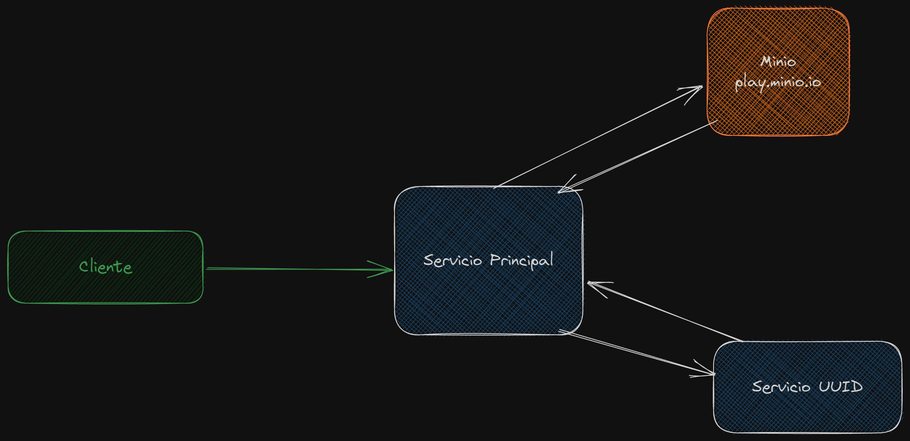
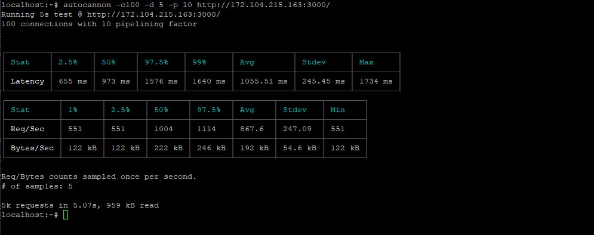
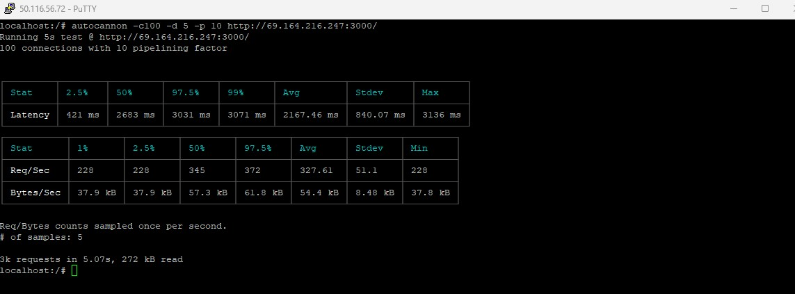

# Benchmark

Comparando velocidad de respuesta de servicios escritos en Nodejs (Nestjs), Go , Java 11 (Spring boot), y .Net 7 (minimal API)

El test se realizo utilizando autocannon con 100 conexiones con un factor de 10 pipelines.

La prueba consiste en 2 servicios un servicio que genera un UUID, y el servicio que invoca a este y genera un archivo que es enviado a Minio

**Servicio Principal**: Llama al servicio Generador de UUID, al obtener el UUID genera un archivo que contiene el UUID, luego lo envía a Minio 'play.minio.io'

**Servicio Generador de UUID**: Genera un UUID

## Especificación de Servidores

**Servicio Principal**:

> - **CPU's**: 2.
> - **RAM**: 4 GB.
> - **Storage**: 80 GB.
> - **Network in/out**: 40 Gbps / 4 Gbps.

**Servicio Generador de UUID**:

> - **CPU's**: 1.
> - **RAM**: 1 GB.
> - **Storage**: 25 GB.
> - **Network in/out**: 40 Gbps / 1 Gbps.

**Servidor cliente**: usado para enviar las conexiones al servicio principal emulando ser un cliente real.

> - **CPU's**: 1.
> - **RAM**: 1 GB.
> - **Storage**: 25 GB.
> - **Network in/out**: 40 Gbps / 1 Gbps.

# Resultados

## Latencia

| Lenguaje |   MAX   |    AVG     |
| -------- | :-----: | :--------: |
| .Net     | 1734 ms | 1055.51 ms |
| GO       | 3136 ms | 2167.46 ms |
| JAVA     | 5017ms  | 2454.89 ms |
| Node     | 4947ms  | 4348.96 ms |

En este caso .Net existe una reducción de tiempos en comparación a node de 75.73% (4348.96 - 1055.51 = (3293.45 / 4348.96) \* 100 ).
o podríamos decir que .Net es un 312% mas rápido que node ( ((1055.51 - 4348.96) / 1055.51) \* 100 )

## Peticiones por segundo

Cantidad de peticiones que atiende por segundo

| Lenguaje | Min |  AVG   |
| -------- | :-: | :----: |
| .Net     | 551 | 867.6  |
| GO       | 228 | 327.61 |
| Java     | 40  | 66.41  |
| Node     | 197 | 187.2  |

Si bien Node atiende 186.2 por segundo estas las realiza de golpe en cambio los otros lenguajes responden a medida van llegando las peticiones.

El contexto de las pruebas es sin ningún tipo de tuning, es tal cual el framework or lenguaje provee las herramientas, en caso de java se podría mejorar con jetty o tuneando el tomcat que esta por defecto.

### **autocannon screenshot**

**.Net 7**

**Go**

**Java 11**

**Node 18 (Nestjs)**

**Nota**: Cada lenguaje de programación tiene sus ventajas y desventajas algunos son mejores en un caso especifico que otros. Este benchmark es simple y no se debe tomar como una ley o algo absoluto., se puede partir de este código para crear benchmark mas elaborados y quien sabe y tengan mejores resultados aplicando tuning o mejores practicas de desarrollo.
